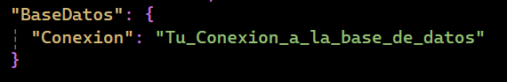

# CrudSqlServer


Este proyecto es una aplicación web CRUD (Crear, Leer, Actualizar, Eliminar) desarrollada con Asp .Net Core 9 y utiliza SQL Server como base de datos.

## Características

- Registro de personas con datos personales.
- Listado, edición y eliminación de registros.
- Validaciones de datos en formularios.
- Uso de Entity Framework Core para acceso a datos.

## Requisitos

- [.NET 9 SDK](https://dotnet.microsoft.com/download)
- SQL Server (local o remoto)
- Visual Studio 2022 o superior (opcional, pero recomendado)

## Configuración

1. **Clona el repositorio:**

```bash
git clone https://github.com/JuanTito-Dev/CrudSqlServer.git

cd CrudSqlServer
```
2. **Configura la cadena de conexión:**
   - Abre el archivo `appsettings.json`.
   - Reemplaza el valor de `"Conexion"` en la sección `"BaseDatos"` por tu cadena de conexión de SQL Server:



## Estructura del Proyecto

- `Controllers/` — Controladores MVC (si existen).
- `Models/` — Modelos de datos.
- `Views/` — Razor Pages (vistas y lógica de página).
- `Data/` — Contexto de base de datos y migraciones.
- `appsettings.json` — Configuración de la aplicación.

## Notas

- Asegúrate de tener SQL Server en ejecución y accesible.
- Puedes personalizar los modelos y las vistas según tus necesidades.

## Contacto

Si tienes alguna pregunta o sugerencia, no dudes en contactarme:

- **Nombre**: Juan Jose Tito Escobar
- **Email**: juan.tito.dev@gmail.com

## Capturas de Pantalla


